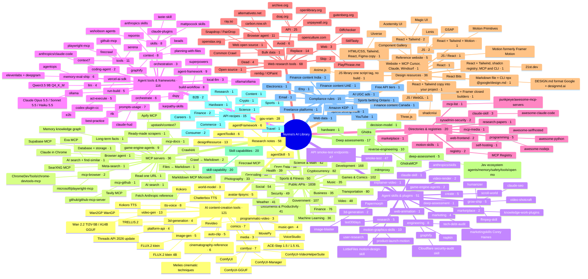

# Nunna's AI Library — Mind map

> Auto-generated. Collections → categories (item count) → adopted items. Full detail in [INDEX.md](INDEX.md).

```mermaid
mindmap
  root((Nunna's AI Library))
    content-tools[AI content-creation tools · 121]
      video-gen · 13
        Wan2GP WanGP
        Wan 2.2 TI2V-5B / A14B GGUF
      tts-voice · 8
        Kokoro TTS
        Chatterbox TTS
        Kokoro
      comfyui · 7
        ComfyUI
        ComfyUI-GGUF
        ComfyUI-Manager
        ComfyUI-VideoHelperSuite
      comics · 7
      cinematography-reference · 6
        Melies cinematic techniques
      image-gen · 5
        FLUX.2 klein
        FLUX.2 klein 4B
      auto-clip · 5
      avatar-lipsync · 5
      music-gen · 4
        ACE-Step 1.5 / 1.5 XL
      3d-generation · 4
        TRELLIS.2
      platform-api · 4
        Threads API 2026 update
      media · 3
        VoiceStudio
      programmatic-video · 3
        Revideo
        MoviePy
      world-model · 3
    mcp-servers[MCP servers · 36]
      game-engine-agents · 9
      mcp-browser · 2
        microsoft/playwright-mcp
        ChromeDevTools/chrome-devtools-mcp
      Crawl → Markdown · 2
        Firecrawl MCP
        Crawl4AI
      Browser agent · 1
        Claude in Chrome
      Read one URL · 1
        Fetch Anthropic reference
      AI search + find-similar · 1
        Exa MCP
      AI search · 1
        Tavily MCP
      Meta-search · 1
        SearXNG MCP
      Ready-made scrapers · 1
        Apify MCP
      Files → Markdown · 1
        Markitdown MCP Microsoft
      mcp-docs · 1
        upstash/context7
      Database + storage · 1
        Supabase MCP
      Long-term facts · 1
        Memory knowledge graph
      mcp-github · 1
        github/github-mcp-server
    skills[Agent skills & plugins · 51]
      motion-graphics-skills · 10
        product-launch-motion
        LottieFiles motion-design-skill
      engineering · 8
        graphify
        napkin
        tech-debt-audit
        Cloudflare security-audit skill
      research · 5
        last30days
        user-research
      create · 5
        scroll-world
      grow-ship · 5
        claude-seo
        humanizer
        video-shotcraft
        ffmpeg-skill
      marketing · 4
        marketingskills Corey Haines
      marketplace · 2
        knowledge-work-plugins
      3d-generation · 2
        image-blaster
      video-render · 2
      game-engine-agents · 2
      deep-assessment · 1
      claude-skill · 1
        anthropics/skills
      explainer-video · 1
        Papermorph
      web-animation · 1
    agent-tools[Agent tools & frameworks · 116]
      tools · 11
        firecrawl
        context7
        github-mcp
        playwright-mcp
        serena
      agent-framework · 9
      build-workflow · 8
        karpathy-skills
        superpowers
      skills · 8
        taste-skill
        anthropics skills
        mattpocock skills
        wshobson agents
        claude-plugins
      context · 8
        planning-with-files
        graphify
        repomix
        beads
      prompts-usage · 7
        best-practice
        codex-plugin-cc
        claude-hud
        rtk
      orchestrate · 6
        dspy
      memory-eval-ship · 6
        agentops
        elevenlabs + deepgram
      run-build · 5
        ollama
      act-execute · 5
        vercel-ai-sdk
        e2b
      llm · 4
        Claude Opus 5.5 / Sonnet 5.5 / Haiku 5.5
        Qwen3.5 9B Q4_K_M
      local-llm · 3
        ollama/ollama
      orchestration · 3
      coding-agent · 2
        anthropics/claude-code
    directories[Directories & registries · 20]
      programming · 5
        awesome-python
        awesome-nodejs
      claude-skill · 3
        awesome-claude-code
      registry · 2
        MCP Registry
      sysadmin-security · 2
      web-frontend · 2
      marketplace · 1
      mcp-list · 1
        punkpeye/awesome-mcp-servers
      mcp-media · 1
      motion-skills · 1
      self-hosting · 1
        awesome-selfhosted
      research-papers · 1
    web-tools[Web research tools · 68]
      API · 25
        unpaywall.org
        openlibrary.org
        doaj.org
        archive.org
        gutenberg.org
      Replace · 14
      Browser agent · 11
        alternativeto.net
        openstax.org
        openculture.com
        carbon.now.sh
        ray.so
      Avoid · 6
      Dead · 4
      Web · 3
        Diffchecker
        PlayPhrase.me
        StillTasty
      Skip · 2
      Bulk data · 1
        Common Crawl
      Web open source · 1
        Snapdrop / PairDrop
      Open source · 1
        rembg / IOPaint
    design-resources[Design resources · 36]
      Reference website · 5
        Component Gallery
      React + Tailwind · 2
        Aceternity UI
        Magic UI
      JS · 2
        GSAP
        Lenis
      Webflow + Framer closed builders · 1
      React · 1
        React Bits
      JS / React · 1
        Motion formerly Framer Motion
      JS / WebGL · 1
        Three.js
      Markdown file + CLI npx @google/design.md · 1
        DESIGN.md format Google + designmd.ai
      Website + MCP Cursor, Claude, Windsurf · 1
      React + Tailwind copy into your project · 1
        shadcn/ui
      JS library one script tag, no build · 1
        Anime.js
      React + Tailwind + Motion · 1
        Motion Primitives
      React + Tailwind, shadcn registry; MCP and CLI · 1
        21st.dev
      HTML/CSS, Tailwind, React, Figma copy · 1
        Uiverse
    assessments[Deep assessments · 17]
      reverse-engineering · 10
        Ghidra
        GhidraMCP
        mitmproxy
      deep-assessment · 5
        Jev ecosystem agents/memory/safety/tools/open mo
      hardware · 1
      decision-model · 1
    skill-capabilities[Skill capabilities · 20]
      skill-capability · 20
    api-recipes[API recipes · 15]
      Finance · 2
      Consumer · 2
      B2B · 2
      Crypto · 1
      Research · 1
      Commerce · 1
      Travel · 1
      Content · 1
      Hardware · 1
      Careers · 1
      Sports · 1
      Science · 1
    compliance[Compliance rules · 15]
      Finance content Canada · 1
      Finance content India · 1
      Finance content UAE · 1
      Sports betting Ontario · 1
      Sports betting India · 1
      Amazon KDP · 1
      Etsy · 1
      YouTube · 1
      AI UGC ads · 1
      Freelance platforms · 1
      Email · 1
      Electronics · 1
      Free API tiers · 1
      Web data · 1
    notes[Research notes · 58]
      gpu-vram · 28
      designResource · 13
      agentToolkit · 6
      agentFramework · 6
      agentSkill · 5
    apis[Public APIs · 1838]
      Development · 168
      Government · 107
      Games & Comics · 102
      Geocoding · 99
      Cryptocurrency · 82
      Transportation · 80
      Finance · 76
      Open Data · 58
      Social · 54
      Sports & Fitness · 50
      Security · 49
      Video · 48
      Science & Math · 42
      Documents & Productivity · 41
      Weather · 41
      Health · 39
      Machine Learning · 36
      Business · 35
      Music · 35
      Photography · 33
    api-test-endpoints[API smoke-test endpoints · 47]
      smoke-test · 47
```
